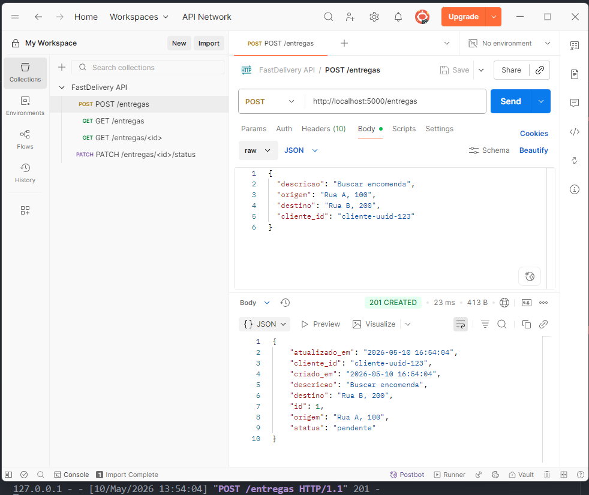
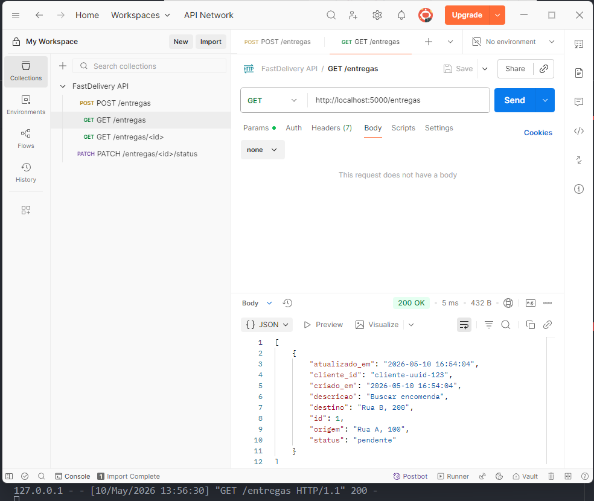
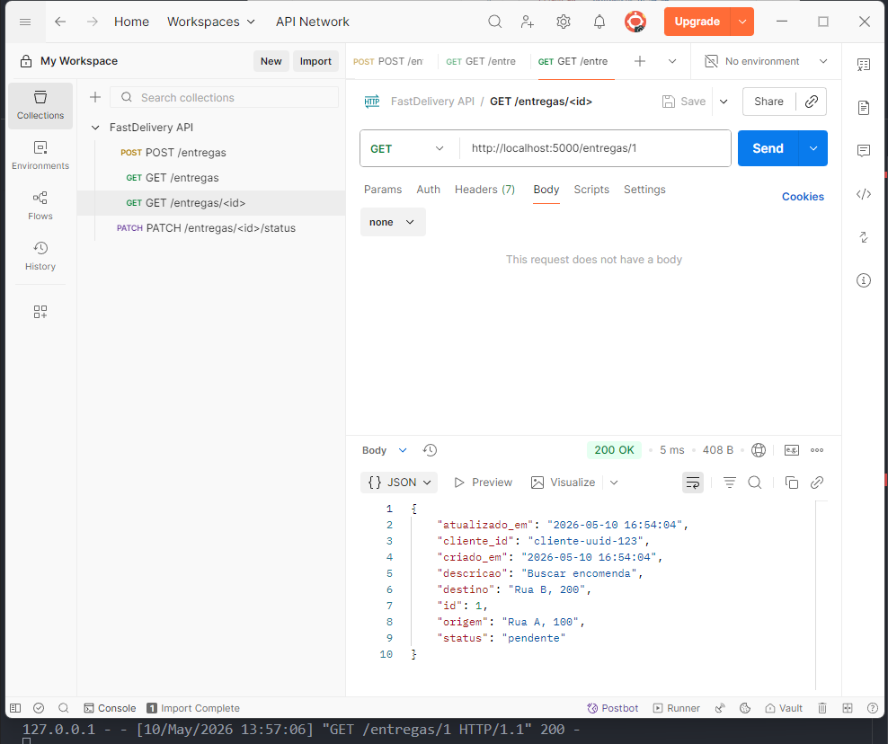

# FastDelivery — Backend REST API

Plataforma de delivery generalista desenvolvida em Flask (Python) com banco de dados SQLite.

## 📋 Visão Geral

FastDelivery é um sistema que conecta **clientes** (que solicitam entregas) e **entregadores** (que aceitam e executam as entregas). Esta é a implementação do backend REST da Sprint 1, com 4 endpoints principais e arquitetura em camadas (Clean Architecture).

## 🏗️ Arquitetura

O código segue **Clean Architecture** com separação em camadas:

```
app/
├── domain/           # Entidades e enums de domínio
├── repositories/     # Acesso aos dados (SQLite)
├── use_cases/        # Lógica de negócio
└── controllers/      # Rotas Flask (thin layer)
```

## 🚀 Setup e Instalação

### Pré-requisitos

- Python 3.8+ (recomendado: 3.12)
- pip (gerenciador de pacotes)
- Docker e Docker Compose (para rodar o RabbitMQ)

> **Windows:** use sempre o comando `py` (Python Launcher) em vez de `python` para garantir que o interpretador correto seja usado.

### Passos

1. **Clonar o repositório e entrar na pasta do servidor**
   ```powershell
   git clone <url-do-repositorio>
   cd Lab-DAMD\Code\server
   ```

2. **Subir o RabbitMQ (MOM)**
   O sistema utiliza RabbitMQ para comunicação assíncrona persistente.
   ```powershell
   docker compose up -d
   ```

3. **Criar ambiente virtual** (opcional, mas recomendado)
   ```powershell
   # Windows (PowerShell)
   py -m venv venv
   .\venv\Scripts\Activate.ps1

   # macOS/Linux
   python3 -m venv venv
   source venv/bin/activate
   ```

   > **Nota PowerShell:** se aparecer erro de política de execução, rode primeiro:
   > `Set-ExecutionPolicy -Scope CurrentUser RemoteSigned`

3. **Instalar dependências** (dentro de `Code\server\`)
   ```powershell
   pip install -r requirements.txt
   ```

4. **Executar o servidor** (dentro de `Code\server\`)
   ```powershell
   Copy-Item .env.example .env
   py main.py

   # Em outro terminal: consumidor independente
   py consumer_worker.py
   ```

   O servidor iniciará em `http://localhost:5055`

### Variáveis de Ambiente

- `EVENT_BUS=rabbitmq`: ativa o **RabbitMQEventBus** e é o padrão.
- `RABBITMQ_HOST`, `RABBITMQ_PORT`, `RABBITMQ_USER` e `RABBITMQ_PASS`: configuram o broker.
- `RABBITMQ_URL`: alternativa AMQP única para configurar o broker.
- `RUN_CONSUMER_IN_PROCESS=false`: mantém backend e consumidor em processos independentes.
- `EVENT_BUS=in_memory`: ativa o **InMemoryEventBus** explicitamente, apenas para testes; com o bootstrap Flask, exige `RUN_CONSUMER_IN_PROCESS=true`.

## 🛰️ Sprint 2 — Integração com MOM

O sistema implementa o padrão **Publish-Subscribe** para notificar eventos de entrega de forma assíncrona.

- **Produtor:** `EntregaUseCases` dispara eventos ao criar ou atualizar status.
- **Consumidor:** `consumer_worker.py` roda de forma independente e processa o backlog da fila.
- **Broker:** RabbitMQ via Docker, com fila durável, confirmação de publicação,
  reconexão do producer, ack manual e DLQ.

### Tópicos Disponíveis
- `entrega.criada`: Disparado ao criar uma nova entrega.
- `entrega.status_atualizado`: Disparado ao alterar o status de uma entrega.

## 📊 Schema do Banco de Dados

### Tabela: `entregas`

| Campo | Tipo | Restrições | Descrição |
|-------|------|-----------|-----------|
| `id` | INTEGER | PRIMARY KEY, AUTOINCREMENT | Identificador único da entrega |
| `descricao` | TEXT | NOT NULL | Descrição do item a entregar |
| `origem` | TEXT | NOT NULL | Endereço de origem |
| `destino` | TEXT | NOT NULL | Endereço de destino |
| `status` | TEXT | NOT NULL, DEFAULT 'pendente' | Status atual (ver valores abaixo) |
| `cliente_id` | TEXT | NOT NULL | ID do cliente que solicitou |
| `criado_em` | TEXT | NOT NULL | Timestamp de criação (ISO 8601) |
| `atualizado_em` | TEXT | NOT NULL | Timestamp da última atualização (ISO 8601) |

### Tabela: `eventos_processados`

Histórico persistente do consumidor, compartilhado com `GET /eventos`. A chave
`evento_id` torna o registro idempotente em caso de redelivery.

#### Valores válidos para `status`

- `pendente` — Entrega aguardando aceite de um entregador
- `aceito` — Entregador aceitou a entrega
- `em_transito` — Entrega a caminho do destino
- `concluido` — Entrega finalizada com sucesso
- `cancelado` — Entrega foi cancelada

```sql
CREATE TABLE entregas (
    id          INTEGER PRIMARY KEY AUTOINCREMENT,
    descricao   TEXT    NOT NULL,
    origem      TEXT    NOT NULL,
    destino     TEXT    NOT NULL,
    status      TEXT    NOT NULL DEFAULT 'pendente',
    cliente_id  TEXT    NOT NULL,
    criado_em   TEXT    NOT NULL DEFAULT (datetime('now')),
    atualizado_em TEXT  NOT NULL DEFAULT (datetime('now'))
);
```

## 🔌 Endpoints da API

### 1. POST /entregas

**Criar nova solicitação de entrega**

**Request:**
```bash
curl -X POST http://localhost:5055/entregas \
  -H "Content-Type: application/json" \
  -d '{
    "descricao": "Buscar encomenda",
    "origem": "Rua A, 100",
    "destino": "Rua B, 200",
    "cliente_id": "cliente-uuid-123"
  }'
```

**Response (201 Created):**
```json
{
  "id": 1,
  "descricao": "Buscar encomenda",
  "origem": "Rua A, 100",
  "destino": "Rua B, 200",
  "status": "pendente",
  "cliente_id": "cliente-uuid-123",
  "criado_em": "2026-05-11T10:00:00",
  "atualizado_em": "2026-05-11T10:00:00"
}
```

---

### 2. GET /entregas

**Listar todas as entregas**

**Request:**
```bash
# Listar todas
curl http://localhost:5055/entregas

# Filtrar por status
curl http://localhost:5055/entregas?status=pendente
```

**Response (200 OK):**
```json
[
  {
    "id": 1,
    "descricao": "Buscar encomenda",
    "origem": "Rua A, 100",
    "destino": "Rua B, 200",
    "status": "pendente",
    "cliente_id": "cliente-uuid-123",
    "criado_em": "2026-05-11T10:00:00",
    "atualizado_em": "2026-05-11T10:00:00"
  }
]
```

---

### 3. GET /entregas/`<id>`

**Consultar detalhes de uma entrega específica**

**Request:**
```bash
curl http://localhost:5055/entregas/1
```

**Response (200 OK):**
```json
{
  "id": 1,
  "descricao": "Buscar encomenda",
  "origem": "Rua A, 100",
  "destino": "Rua B, 200",
  "status": "pendente",
  "cliente_id": "cliente-uuid-123",
  "criado_em": "2026-05-11T10:00:00",
  "atualizado_em": "2026-05-11T10:00:00"
}
```

**Response (404 Not Found):**
```json
{
  "error": "Entrega não encontrada"
}
```

---

### 4. PATCH /entregas/`<id>`/status

**Atualizar status de uma entrega**

**Request:**
```bash
curl -X PATCH http://localhost:5055/entregas/1/status \
  -H "Content-Type: application/json" \
  -d '{"status": "aceito"}'
```

**Response (200 OK):**
```json
{
  "id": 1,
  "descricao": "Buscar encomenda",
  "origem": "Rua A, 100",
  "destino": "Rua B, 200",
  "status": "aceito",
  "cliente_id": "cliente-uuid-123",
  "criado_em": "2026-05-11T10:00:00",
  "atualizado_em": "2026-05-11T10:00:50"
}
```

**Response (400 Bad Request):**
```json
{
  "error": "Status inválido"
}
```

**Response (404 Not Found):**
```json
{
  "error": "Entrega não encontrada"
}
```

---

### 5. GET /eventos

**Listar eventos processados pelo consumidor MOM**

**Request:**
```bash
# Obter últimos eventos (padrão 10)
curl http://localhost:5055/eventos

# Filtrar quantidade
curl http://localhost:5055/eventos?ultimos=5
```

**Response (200 OK):**
```json
[
  {
    "tipo": "entrega.criada",
    "entrega_id": 1,
    "mensagem": "Nova entrega criada: Buscar encomenda",
    "processado_em": "2026-05-22T10:00:00",
    "payload": { "id": 1, "status": "pendente" }
  }
]
```

---

## 🧪 Testando a API

### Com Postman/Insomnia

Importe o arquivo `postman_collection.json` na sua ferramenta de testes (Postman, Insomnia, etc.). A coleção contém todos os 4 endpoints pré-configurados com exemplos de request e documentação.

### Evidências de execução

Todos os endpoints foram testados com o servidor rodando localmente em `http://localhost:5055`.

#### POST /entregas — Criar nova entrega



Cria uma nova solicitação com status inicial `pendente`. Retorna `201 Created` com o objeto completo.

---

#### GET /entregas — Listar todas as entregas



Lista todas as entregas cadastradas. Suporta filtro opcional `?status=<valor>`. Retorna `200 OK` com array de objetos.

---

#### GET /entregas/\<id\> — Consultar entrega por ID



Retorna os detalhes de uma entrega específica. Retorna `200 OK` com o objeto ou `404 Not Found` se o id não existir.

---

#### PATCH /entregas/\<id\>/status — Atualizar status


Atualiza o status de uma entrega existente. Retorna `200 OK` com o objeto atualizado, `400 Bad Request` para status inválido ou `404 Not Found` se o id não existir.

### Com curl

Veja exemplos nos endpoints acima ou use:

```bash
# Criar entrega
curl -X POST http://localhost:5055/entregas \
  -H "Content-Type: application/json" \
  -d '{"descricao":"Test","origem":"A","destino":"B","cliente_id":"c1"}'

# Listar entregas
curl http://localhost:5055/entregas

# Obter entrega específica
curl http://localhost:5055/entregas/1

# Atualizar status
curl -X PATCH http://localhost:5055/entregas/1/status \
  -H "Content-Type: application/json" \
  -d '{"status":"aceito"}'
```

## 📁 Estrutura do Projeto

```
Lab-DAMD/
├── Code/
│   └── server/
│       ├── app/
│       │   ├── domain/
│       │   │   └── models.py              # Entidades (Entrega, StatusEntrega)
│       │   ├── repositories/
│       │   │   └── entrega_repository.py  # Acesso a SQLite
│       │   ├── use_cases/
│       │   │   └── entrega_use_cases.py   # Lógica de negócio
│       │   ├── controllers/
│       │   │   └── entrega_controller.py  # Rotas Flask
│       │   ├── mom/                       # Camada de mensageria (EventBus)
│       │   └── database.py                # Conexão SQLite
│       ├── main.py                        # Entry point
│       ├── docker-compose.yml             # Infra RabbitMQ
│       └── requirements.txt               # Dependências
├── docs/
│   ├── Sprint2/                           # Documentação da Integração MOM
│   └── Sprint3/                           # Specs do App Flutter Cliente
├── postman_collection.json                # Coleção de testes (v2)
└── README.md                              # Este arquivo
```

## 📑 Documentação da Sprint 2

- [Guia de Eventos e Tópicos](docs/Sprint2/eventos.md)
- [Relatório Técnico de Integração](docs/Sprint2/Relatorio_Sprint2_RabbitMQ.md)
- [Evidências de Execução MOM](docs/Sprint2/evidencias/)

## 📑 Specs da Sprint 3

- [Visão geral e decisões](docs/Sprint3/README.md)
- [Spec do App Cliente](docs/Sprint3/spec_app_cliente.md)
- [Arquitetura do App Cliente](docs/Sprint3/arquitetura_app_cliente.md)
- [Plano de Testes e Critérios de Aceite](docs/Sprint3/plano_testes_e_aceite.md)

## 🔧 Dependências

- **Flask** — Framework web HTTP
- **pika** — Driver AMQP para integração com RabbitMQ
- **SQLite3** — Banco de dados (já vem com Python)

Veja `requirements.txt` para a versão exata.

## 📝 Notas de Desenvolvimento

- O banco de dados SQLite é inicializado automaticamente no primeiro start
- Timestamps utilizam formato ISO 8601 (UTC)
- Todos os erros retornam JSON estruturado com campo `error`
- A validação de status ocorre na camada de use cases
- O `InMemoryEventBus` só é habilitado explicitamente com `EVENT_BUS=in_memory` em testes.

## 📋 Sprint 1 — Checklist

- [x] Estrutura de Clean Architecture definida
- [x] Banco de dados SQLite com schema
- [x] Modelo de domínio (Entrega + StatusEntrega enum)
- [x] Repository com CRUD
- [x] Use cases (lógica de negócio)
- [x] Flask routes (POST, GET, PATCH)
- [x] Validação e tratamento de erros
- [x] Coleção Postman
- [x] README

## 📋 Sprint 2 — Checklist (MOM)

- [x] Barramento abstrato e implementações (RabbitMQ + Memory para testes)
- [x] Docker Compose para RabbitMQ local
- [x] Produtor de eventos integrado aos Use Cases
- [x] Consumidor standalone com histórico persistente e idempotente
- [x] Novo endpoint `GET /eventos`
- [x] Diagrama C4 atualizado com MOM sólido
- [x] Relatório de integração e catálogo de eventos
- [x] Fila durável, publisher confirms, ack manual e DLQ

## 📡 Tempo real — WS /ws/eventos (Sprint 4)

Além do REST, o backend expõe um **WebSocket** em `/ws/eventos` para notificação
assíncrona do app do prestador. Uma **ponte** (thread no Flask) consome os eventos
do RabbitMQ por uma fila dedicada `fastdelivery.realtime` (ligada ao exchange
`fastdelivery.events`) e os repassa às conexões WebSocket abertas. Assim, quando o
cliente cria uma solicitação, o prestador é avisado **na hora**, sem polling.

- A ponte usa uma fila **própria** (não a `fastdelivery.entregas` do
  `consumer_worker.py`), então não há *competing consumers* — cada um recebe sua
  cópia via o exchange topic.
- Exige RabbitMQ no ar e é iniciada junto com `py main.py` (mensagem
  `Tempo real....: WS /ws/eventos` no log de boot).
- Os clientes informam a URL via `--dart-define=FASTDELIVERY_WS_URL=ws://10.0.2.2:5055/ws/eventos`
  (ou ela é derivada de `FASTDELIVERY_API_URL`).

## 📱 Aplicativos Flutter

| App | Pasta | Papel |
|-----|-------|-------|
| Cliente | `Code/mobile/fastdelivery_cliente/` | Cria, lista, detalha e cancela entregas. Atualiza por **polling** REST (5s). |
| Prestador | `Code/mobile/fastdelivery_prestador/` | Recebe solicitações **em tempo real** (WebSocket), aceita/recusa e acompanha as entregas em andamento. |

Os dois apps são **independentes** (executáveis e `applicationId` distintos) e
seguem a mesma Clean Architecture (`core/`, `features/entregas/{domain,data,application,presentation}`).

## ▶️ Executando o sistema completo (backend + MOM + 2 apps)

```powershell
# 1. MOM (RabbitMQ)
cd Code\server
docker compose up -d

# 2. Backend (REST + producer + ponte WebSocket)
py main.py

# 3. Consumidor de histórico (processo separado)
py consumer_worker.py

# 4. App do cliente (em outro terminal)
cd ..\mobile\fastdelivery_cliente
flutter run --dart-define=FASTDELIVERY_API_URL=http://10.0.2.2:5055

# 5. App do prestador (em outro terminal)
cd ..\fastdelivery_prestador
flutter run `
  --dart-define=FASTDELIVERY_API_URL=http://10.0.2.2:5055 `
  --dart-define=FASTDELIVERY_WS_URL=ws://10.0.2.2:5055/ws/eventos
```

> **Emulador Android:** use `10.0.2.2` (alias do host). **Windows desktop/web:**
> use `127.0.0.1` no lugar de `localhost` (em algumas máquinas `localhost` resolve
> primeiro para IPv6 e o servidor de dev escuta em IPv4).

**Fluxo ponta a ponta:** crie uma entrega no app do cliente → ela aparece
imediatamente no app do prestador (via MOM → WebSocket) → aceite no prestador →
o cliente reflete o status em até 5s (polling).

## 📚 Próximas Fases / Status

- **Sprint 3:** App Flutter — Cliente (specs em `docs/Sprint3/`) ✅
- **Sprint 4:** App Flutter — Prestador + notificação assíncrona via MOM
  (docs em `docs/Sprint4/`) ✅ código | refino visual e relatório final em andamento

---

**Desenvolvido para:** Lab. de Desenvolvimento de Aplicações Móveis e Distribuídas (LDAMD) — PUC Minas
