# FastDelivery - Evidências da Sprint 2 com RabbitMQ

Este documento descreve como executar e demonstrar a integração assíncrona da
Sprint 2 do FastDelivery. O objetivo é comprovar que o backend produtor e o
consumidor possuem ciclos de vida independentes e que o RabbitMQ é o único elo
entre eles.

## 1. Arquitetura demonstrada

O fluxo executado é:

```text
Terminal 3                    Terminal 2                    RabbitMQ                    Terminal 4
Cliente HTTP  -- REST -->     Flask / Producer  -- AMQP --> fila durável  -- AMQP -->  Consumer Worker
                                                               |
                                                               +--> Dead-Letter Queue
```

- O cliente envia requisições REST somente para o backend Flask.
- O backend persiste a entrega no SQLite e publica eventos no RabbitMQ.
- O backend não chama o consumidor diretamente.
- O RabbitMQ armazena as mensagens na fila `fastdelivery.entregas`.
- O consumidor standalone lê a fila quando estiver ativo.
- Se o consumidor estiver desligado, o backlog permanece no broker.
- Se uma mensagem falhar durante o processamento, ela segue para
  `fastdelivery.dlq`.

Os dois eventos de negócio demonstrados são:

| Evento | Momento de publicação | Produtor | Consumidor |
|---|---|---|---|
| `entrega.criada` | Após criar uma entrega com `POST /entregas` | `EntregaEventProducer.entrega_criada()` | `_ao_criar_entrega()` |
| `entrega.status_atualizado` | Após alterar o status com `PATCH /entregas/<id>/status` | `EntregaEventProducer.status_alterado()` | `_ao_alterar_status()` |

## 2. Preparação

Abra o Docker Desktop e aguarde o engine iniciar. Depois, abra um PowerShell:

```powershell
cd C:\Users\gpercope\Documents\GitHub\Lab-DAMD\Code\server
Copy-Item .env.example .env -ErrorAction SilentlyContinue
pip install -r requirements.txt
docker compose up -d
docker compose ps
```

O container esperado é:

```text
fastdelivery-rabbitmq
```

Abra a interface do broker:

```text
http://localhost:15672
```

Credenciais:

```text
Usuário: guest
Senha:   guest
```

### Observação sobre a porta AMQP no Windows

O RabbitMQ usa internamente a porta `5672`. Nesta máquina, o Windows reservou
essa porta. Por isso, o arquivo `.env` local usa:

```text
RABBITMQ_HOST_PORT=5679
RABBITMQ_PORT=5679
```

O navegador continua acessando a UI normalmente pela porta `15672`.

## 3. Terminal 1 - Broker RabbitMQ

O Terminal 1 é usado para iniciar e conferir a infraestrutura:

```powershell
cd C:\Users\gpercope\Documents\GitHub\Lab-DAMD\Code\server
docker compose up -d
docker compose ps
```

Depois que o backend iniciar, abra a aba **Queues and Streams** da UI. As filas
declaradas automaticamente são:

```text
fastdelivery.entregas
fastdelivery.dlq
```

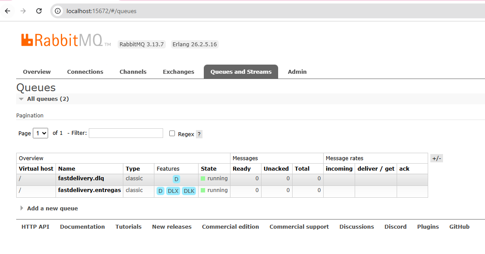

A fila principal foi conferida vazia antes do teste:

```text
Ready:     0
Unacked:   0
Total:     0
Consumers: 0
```

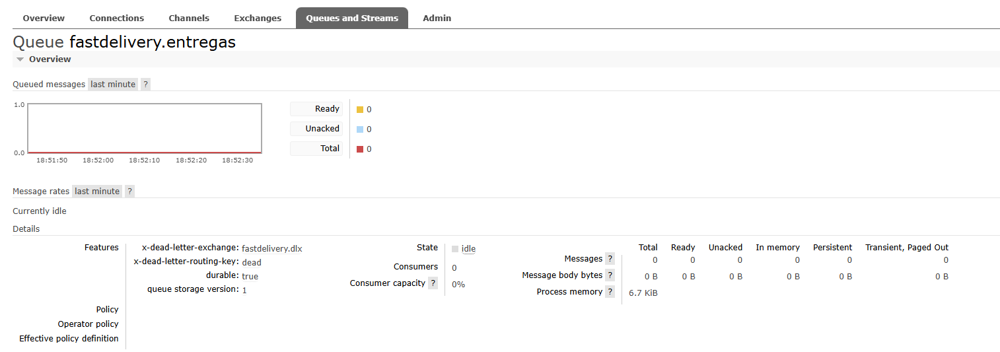

## 4. Terminal 2 - Backend produtor independente

Abra outro PowerShell e inicie somente o backend Flask:

```powershell
cd C:\Users\gpercope\Documents\GitHub\Lab-DAMD\Code\server
py main.py
```

O arquivo `.env` mantém:

```text
RUN_CONSUMER_IN_PROCESS=false
```

Isso garante que o Flask atue como produtor puro. O log confirma:

```text
[RabbitMQ] Cliente conectado apenas para publicação
Consumidor in-process: OFF (use consumer_worker.py)
```

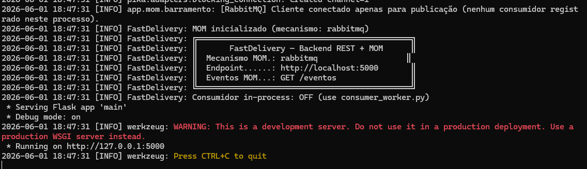

## 5. Terminal 3 - Cliente publica dois eventos

Com o consumer ainda desligado, abra um terceiro PowerShell:

```powershell
cd C:\Users\gpercope\Documents\GitHub\Lab-DAMD\Code\server
```

Crie uma entrega:

```powershell
$body = @{
  descricao = "Pacote demonstracao Sprint 2"
  origem = "Rua A, 100"
  destino = "Rua B, 200"
  cliente_id = "cliente-001"
} | ConvertTo-Json

$entrega = Invoke-RestMethod `
  -Method Post `
  -Uri "http://localhost:5000/entregas" `
  -ContentType "application/json" `
  -Body $body

$entrega | ConvertTo-Json
```

A resposta retorna a entrega com status inicial `pendente`:

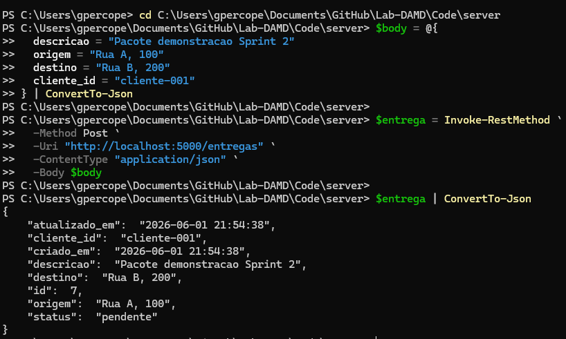

No Terminal 2, o backend confirma a publicação:

```text
[RabbitMQ] Publicado em "entrega.criada"
Evento publicado: entrega.criada
POST /entregas HTTP/1.1" 201
```

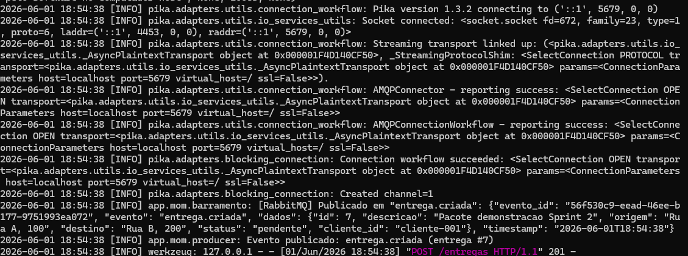

Ainda com o consumer desligado, altere o status:

```powershell
Invoke-RestMethod `
  -Method Patch `
  -Uri "http://localhost:5000/entregas/$($entrega.id)/status" `
  -ContentType "application/json" `
  -Body '{"status":"aceito"}' |
  ConvertTo-Json
```

O cliente recebe a entrega atualizada:

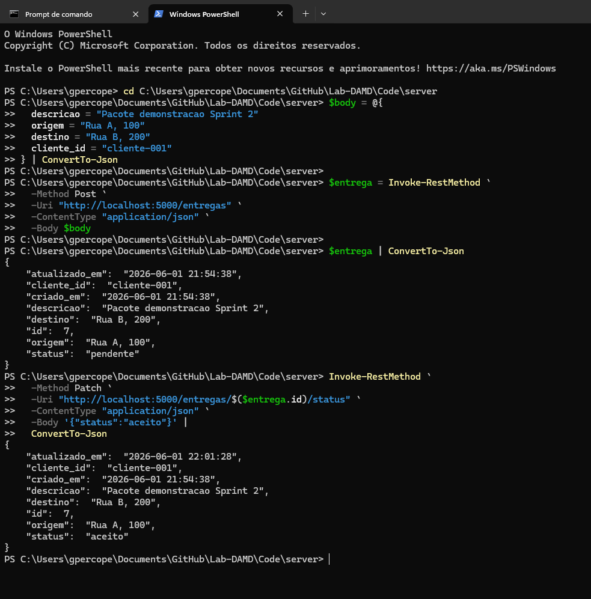

O resultado da transição também pode ser observado isoladamente:

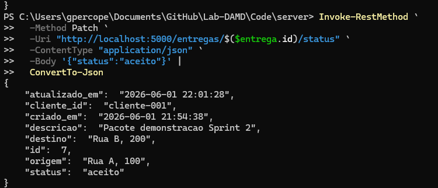

No Terminal 2, o producer publica o segundo evento:

```text
[RabbitMQ] Publicado em "entrega.status_atualizado"
Evento publicado: entrega.status_atualizado
PATCH /entregas/7/status HTTP/1.1" 200
```

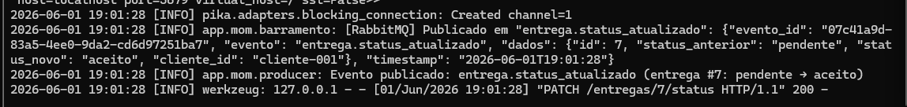

## 6. Prova principal - Backlog sem consumidor

Neste momento:

- O backend Flask está ativo.
- O consumer standalone ainda não foi iniciado.
- O producer publicou dois eventos.
- O RabbitMQ armazenou os eventos na fila.

Na UI do RabbitMQ, a fila `fastdelivery.entregas` mostra:

```text
Ready:   2
Unacked: 0
Total:   2
```

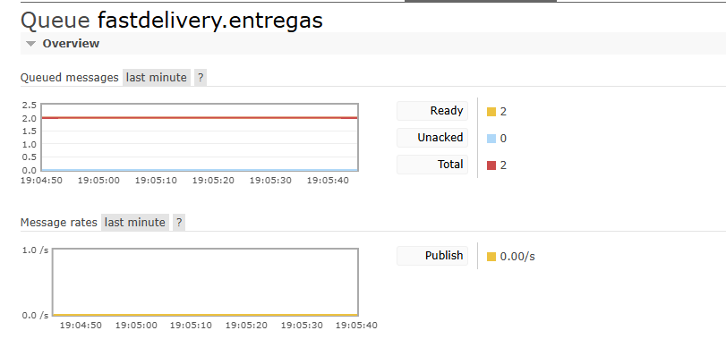

Essa é a principal evidência de desacoplamento. O producer consegue publicar
mesmo sem um consumer disponível. O broker guarda as mensagens até que algum
consumidor esteja pronto para processá-las.

## 7. Terminal 4 - Consumer standalone

Somente depois de comprovar o backlog, abra um quarto PowerShell:

```powershell
cd C:\Users\gpercope\Documents\GitHub\Lab-DAMD\Code\server
py consumer_worker.py
```

O terminal declara explicitamente:

```text
WORKER CONSUMIDOR STANDALONE (processo independente)
Sem Flask, sem REST - apenas escutando o broker
```

Em seguida, o worker recebe os eventos acumulados:

```text
[RabbitMQ] Recebido de "entrega.criada"
CONSUMIDOR -> Nova entrega criada!

[RabbitMQ] Recebido de "entrega.status_atualizado"
CONSUMIDOR -> Status de entrega alterado!
Status: pendente -> aceito
```

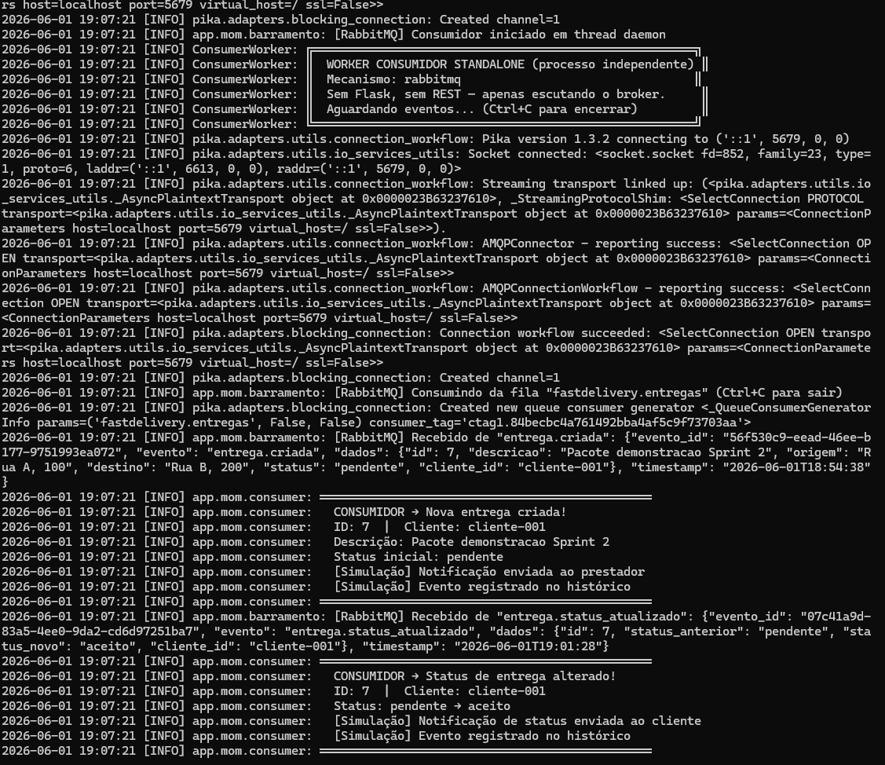

Após o processamento, o consumer envia `ack`. A fila volta a zero:

```text
Ready:   0
Unacked: 0
Total:   0
```

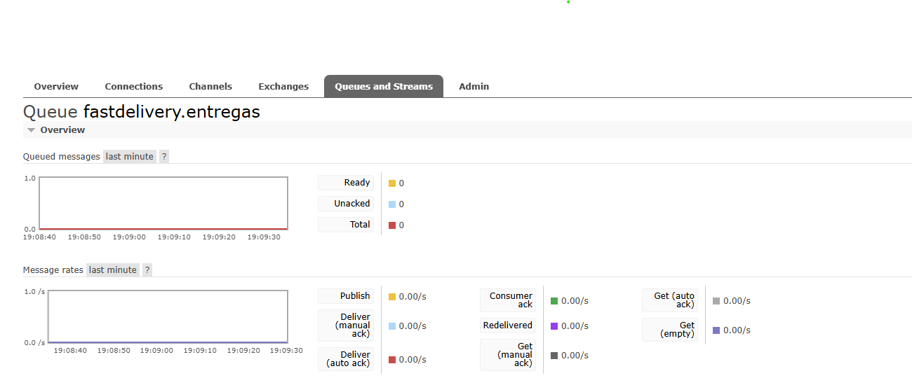

## 8. Histórico compartilhado no SQLite

O consumer registra os eventos processados no SQLite. O backend expõe esse
histórico pelo endpoint `GET /eventos`.

No Terminal 3:

```powershell
Invoke-RestMethod `
  -Uri "http://localhost:5000/eventos" |
  ConvertTo-Json -Depth 10
```

O retorno contém os dois tipos de evento e seus `evento_id`:

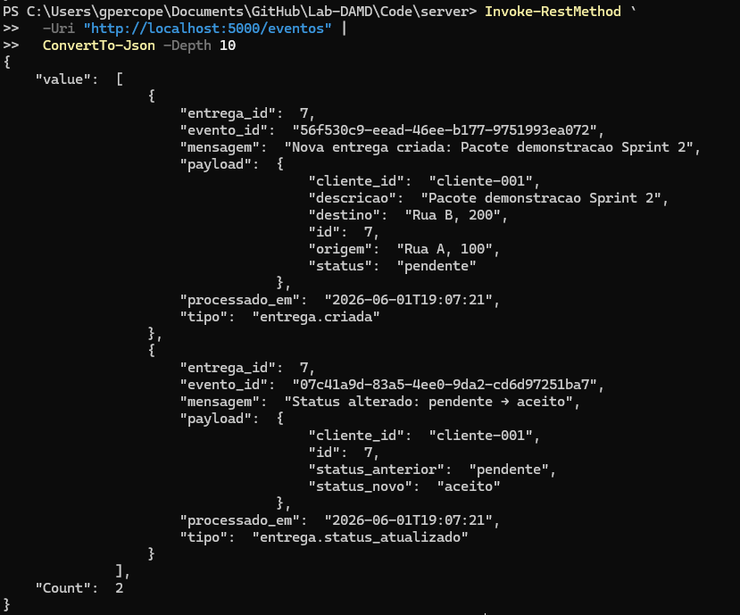

O campo `evento_id` permite que o consumer ignore uma eventual entrega repetida
da mesma mensagem. Essa idempotência é importante porque a estratégia adotada
é **at-least-once**: uma mensagem pode ser reenviada em caso de falha, mas não
deve gerar efeitos duplicados.

## 9. Como o RabbitMQ aumenta a confiabilidade

A implementação possui:

| Recurso | Finalidade |
|---|---|
| Exchange `fastdelivery.events` do tipo `topic` | Receber eventos do domínio |
| Fila durável `fastdelivery.entregas` | Preservar o backlog enquanto o consumer estiver desligado |
| Mensagens com `delivery_mode=2` | Persistir as mensagens |
| `publisher confirms` | Evitar perda silenciosa durante a publicação |
| Uma tentativa de reconexão | Recuperar uma conexão AMQP encerrada |
| `ack` manual | Remover a mensagem somente após processamento bem-sucedido |
| `nack(requeue=False)` | Encaminhar falhas para a DLQ |
| Fila `fastdelivery.dlq` | Isolar mensagens problemáticas |
| `evento_id` persistido no SQLite | Evitar processamento duplicado |

Durante a execução demonstrada, a conexão AMQP antiga foi encerrada e o producer
se recuperou automaticamente. O log registrou:

```text
[RabbitMQ] Publicação falhou em "entrega.criada"; reconectando para uma nova tentativa
[RabbitMQ] Publicado em "entrega.criada"
```

Isso comprova que a nova tentativa de publicação foi aplicada com sucesso.

## 10. Testes automatizados

Execute dentro de `Code/server/`:

```powershell
py -m unittest discover -s tests -v
```

A suíte atual executa oito testes em `tests/test_mom.py`:

| Teste | O que verifica |
|---|---|
| `test_in_memory_requires_explicit_configuration` | O barramento em memória só é usado quando configurado explicitamente para testes |
| `test_rabbitmq_is_the_default_bus` | O RabbitMQ é o barramento padrão da aplicação |
| `test_acknowledges_message_after_successful_handler` | Uma mensagem processada com sucesso recebe `basic_ack` |
| `test_sends_message_to_dlq_when_handler_fails` | Uma exceção no handler gera `basic_nack(requeue=False)` |
| `test_sends_unknown_topic_to_dlq` | Um tópico sem handler também segue para a DLQ |
| `test_replaces_connection_when_publish_channel_is_closed` | Um canal de publicação encerrado é substituído |
| `test_retries_publish_once_after_connection_failure` | Uma falha transitória provoca uma nova tentativa |
| `test_history_is_persistent_and_idempotent` | O mesmo `evento_id` é registrado somente uma vez no SQLite |

Resultado esperado:

```text
Ran 8 tests
OK
```

### Limite conhecido da suíte

O arquivo `tests/test_entregas.py` ainda contém apenas um placeholder. Portanto,
os endpoints REST foram validados manualmente nas evidências desta documentação.
Os oito testes automatizados cobrem a camada MOM, não toda a API REST.

## 11. Sequência curta para apresentar ao professor

1. Mostrar o backend Flask com `Consumidor in-process: OFF`.
2. Mostrar as filas RabbitMQ inicialmente vazias.
3. Executar `POST /entregas` e `PATCH /entregas/<id>/status`.
4. Mostrar os logs das duas publicações no producer.
5. Mostrar `Ready = 2` no RabbitMQ enquanto o consumer permanece desligado.
6. Iniciar `py consumer_worker.py` em outro terminal.
7. Mostrar o worker standalone processando os dois eventos.
8. Mostrar a fila novamente com `Ready = 0`.
9. Executar `GET /eventos` e mostrar o histórico SQLite.
10. Executar a suíte automatizada e mostrar `Ran 8 tests` e `OK`.

O ponto central da apresentação é comparar estes dois momentos:

| Antes de iniciar o consumer | Depois de iniciar o consumer |
|---|---|
| `Ready = 2`, pois o RabbitMQ preserva o backlog | `Ready = 0`, pois o worker processou e confirmou as mensagens |

