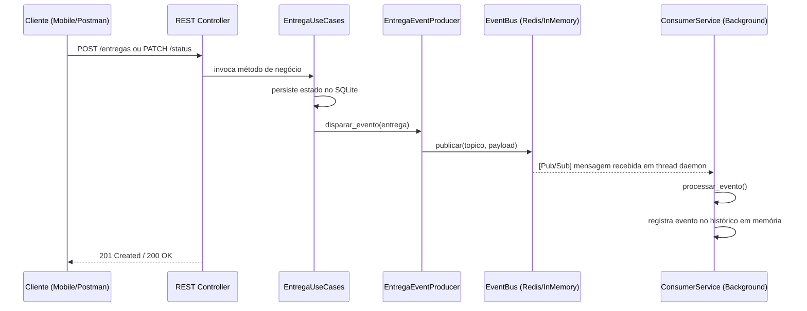

# FastDelivery — Catálogo de Eventos (Sprint 2)

Este documento descreve os eventos de domínio utilizados para a comunicação assíncrona via MOM (Message Oriented Middleware) na plataforma FastDelivery.

| Evento | Tópico | Produtor | Consumidor | Quando dispara |
|--------|--------|----------|------------|----------------|
| Entrega Criada | `entrega.criada` | `EntregaUseCases.criar_entrega()` | `consumer._ao_criar_entrega` | Após a criação de uma nova solicitação (`POST /entregas`) |
| Status Alterado | `entrega.status_atualizado` | `EntregaUseCases.atualizar_status()` | `consumer._ao_alterar_status` | Após a transição de status de uma entrega (`PATCH /entregas/<id>/status`) |

## Payloads (JSON)

Estes payloads representam a estrutura de dados que trafega pelo barramento (Redis Pub/Sub). Foram capturados durante a execução real do sistema.

### entrega.criada
```json
{
  "evento": "entrega.criada",
  "dados": {
    "id": 5,
    "descricao": "Pacote Teste MOM",
    "origem": "Rua A",
    "destino": "Rua B",
    "status": "pendente",
    "cliente_id": "cliente-123"
  },
  "timestamp": "2026-05-22T22:30:41"
}
```

### entrega.status_atualizado
```json
{
  "evento": "entrega.status_atualizado",
  "dados": {
    "id": 1,
    "status_anterior": "pendente",
    "status_novo": "aceito",
    "cliente_id": "cliente-uuid-123"
  },
  "timestamp": "2026-05-22T22:30:41"
}
```
*Nota: Embora nos logs de evidência o status mude para o mesmo valor, o catálogo acima documenta uma transição típica (pendente → aceito).*

## Diagrama de fluxo

O diagrama abaixo ilustra o fluxo de uma operação desde a requisição REST do cliente até o processamento assíncrono pelo consumidor desacoplado.



---
*Gerado automaticamente para documentação da Sprint 2.*
