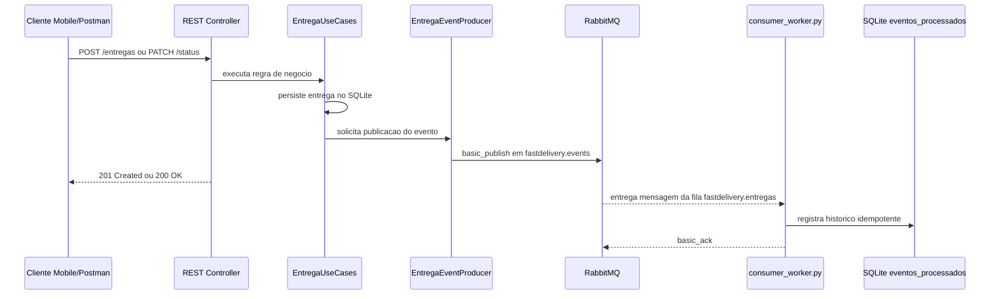

# FastDelivery - Catalogo de Eventos (Sprint 2)

Este documento descreve os eventos de dominio usados na comunicacao assincrona do FastDelivery. A implementacao atual usa RabbitMQ via AMQP, com exchange `fastdelivery.events`, fila duravel `fastdelivery.entregas` e Dead-Letter Queue `fastdelivery.dlq`.

## Topologia

| Elemento | Valor | Finalidade |
|---|---|---|
| Exchange principal | `fastdelivery.events` | Recebe eventos publicados pelo backend Flask. |
| Tipo da exchange | `topic` | Usa a routing key como topico do evento. |
| Fila principal | `fastdelivery.entregas` | Guarda backlog de eventos ate o consumidor processar. |
| Binding | `#` | Encaminha todos os eventos de entrega para a fila principal. |
| DLX | `fastdelivery.dlx` | Recebe mensagens rejeitadas pelo consumer. |
| DLQ | `fastdelivery.dlq` | Isola mensagens com falha de processamento. |

## Eventos

| Evento | Routing key | Produtor | Consumidor | Quando dispara |
|---|---|---|---|---|
| Entrega criada | `entrega.criada` | `EntregaUseCases.criar_entrega()` via `EntregaEventProducer.entrega_criada()` | `consumer_worker.py` registra `_ao_criar_entrega()` | Apos `POST /entregas` persistir a nova entrega. |
| Status atualizado | `entrega.status_atualizado` | `EntregaUseCases.atualizar_status()` via `EntregaEventProducer.status_alterado()` | `consumer_worker.py` registra `_ao_alterar_status()` | Apos `PATCH /entregas/<id>/status` persistir o novo status. |

## Payloads JSON

### `entrega.criada`

```json
{
  "evento_id": "56f530c9-eead-46ee-b177-9751993ea072",
  "evento": "entrega.criada",
  "dados": {
    "id": 7,
    "descricao": "Pacote demonstracao Sprint 2",
    "origem": "Rua A, 100",
    "destino": "Rua B, 200",
    "status": "pendente",
    "cliente_id": "cliente-001"
  },
  "timestamp": "2026-06-01T18:54:38"
}
```

### `entrega.status_atualizado`

```json
{
  "evento_id": "07c41a9d-83a5-4ee0-9da2-cd6d97251ba7",
  "evento": "entrega.status_atualizado",
  "dados": {
    "id": 7,
    "status_anterior": "pendente",
    "status_novo": "aceito",
    "cliente_id": "cliente-001"
  },
  "timestamp": "2026-06-01T19:01:28"
}
```

## Campos comuns

| Campo | Finalidade |
|---|---|
| `evento_id` | UUID unico usado para idempotencia no consumidor. |
| `evento` | Nome do evento e routing key usada na publicacao. |
| `dados` | Payload especifico do evento de negocio. |
| `timestamp` | Data e hora de criacao do evento em formato ISO-like. |

## Diagrama de fluxo



## Garantias relevantes

- O produtor nao chama o consumidor diretamente.
- O consumidor roda em `consumer_worker.py`, processo separado do Flask.
- A fila principal e duravel e as mensagens sao persistentes (`delivery_mode=2`).
- O consumer usa `ack` manual apos sucesso.
- Falha de handler gera `nack(requeue=False)` e a mensagem vai para a DLQ.
- `GET /eventos` consulta o historico persistente registrado pelo consumidor.
