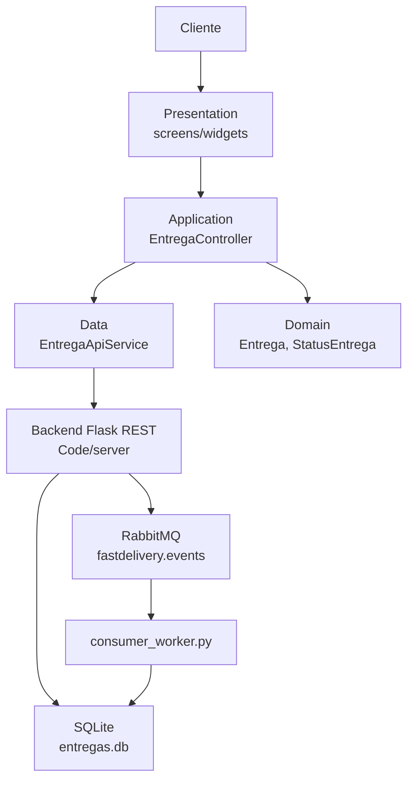
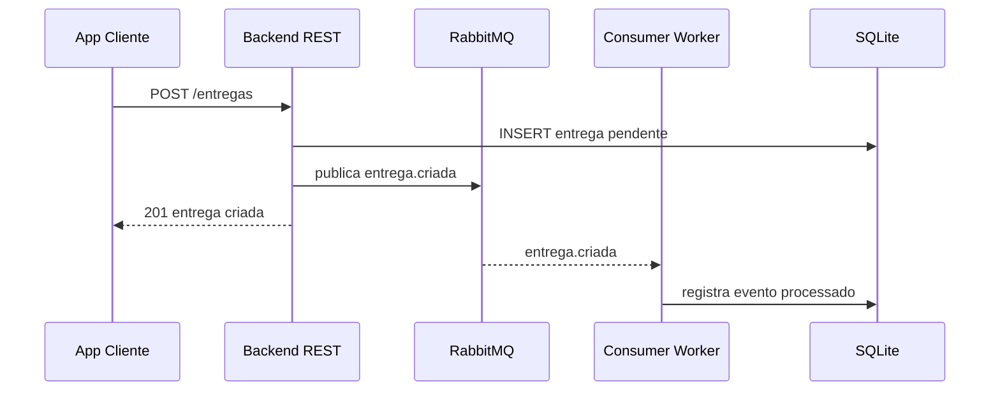
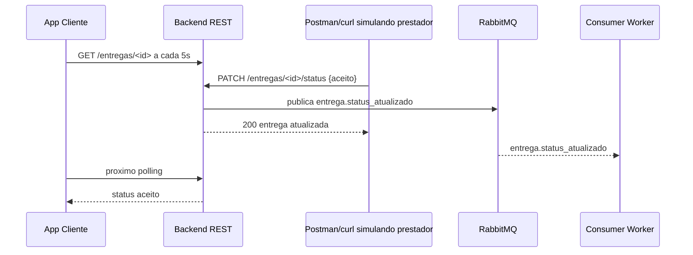

# Arquitetura - App Flutter Cliente

## Direcao geral

Usar uma arquitetura simples, em camadas, sem frameworks complexos de estado. A Sprint 3 vale mais pela funcionalidade executavel, integracao REST e atualizacao assincrona do que por infraestrutura sofisticada.

Recomendacao:

- Flutter Material 3.
- Dependencia externa principal: `http`.
- Estado local com `StatefulWidget`, `ChangeNotifier` simples ou controller proprio.
- Sem Bloc/Riverpod/GetX, a menos que ja exista dominio forte do time.
- Sem geracao de codigo.

## Estrutura sugerida

```text
Code/mobile/fastdelivery_cliente/
  pubspec.yaml
  README.md
  lib/
    main.dart
    app.dart
    core/
      config/
        api_config.dart
      http/
        api_exception.dart
    features/
      entregas/
        application/
          entrega_controller.dart
        data/
          entrega_api_service.dart
        domain/
          entrega.dart
          status_entrega.dart
        presentation/
          screens/
            entrega_list_screen.dart
            entrega_detail_screen.dart
            entrega_form_screen.dart
          widgets/
            entrega_card.dart
            status_badge.dart
            loading_view.dart
            error_view.dart
            empty_state.dart
  test/
    features/
      entregas/
        entrega_model_test.dart
        entrega_api_service_test.dart
        entrega_form_screen_test.dart
```

## Diagrama de camadas



## Fluxo de criacao



## Fluxo de atualizacao assincrona da Sprint 3



## Configuracao de URL

O app deve aceitar a URL da API por `dart-define`:

```powershell
flutter run --dart-define=FASTDELIVERY_API_URL=http://localhost:5055
```

Valores comuns:

| Ambiente | URL recomendada |
|---|---|
| Windows desktop | `http://localhost:5055` |
| Android emulator | `http://10.0.2.2:5055` |
| Dispositivo fisico na mesma rede | `http://<IP-DA-MAQUINA>:5055` |

Evitar alterar o backend apenas por causa de URL. CORS so deve ser adicionado se a demonstracao for em Flutter Web.

## Polling

Regras:

- Intervalo padrao: 5 segundos.
- Iniciar polling em `initState`.
- Parar polling em `dispose`.
- Nao criar multiplos timers para a mesma tela.
- Nao disparar nova requisicao se uma anterior da mesma tela ainda estiver em andamento.
- Em erro temporario, manter a tela atual e mostrar aviso discreto.

## Tratamento de erros

O backend usa o formato:

```json
{"error": "mensagem"}
```

O app deve:

- Mostrar a mensagem do backend quando existir.
- Mostrar mensagem generica quando a API estiver fora do ar.
- Nunca quebrar a tela por JSON inesperado.
- Permitir tentar novamente na lista e nos detalhes.

## Design visual

Direcao: simples, limpo e operacional.

- Fundo claro.
- App bar com nome `FastDelivery`.
- Lista com cards compactos, raio maximo de 8 px.
- Badges de status:
  - `pendente`: amarelo/ambar.
  - `aceito`: azul.
  - `em_transito`: roxo ou ciano moderado.
  - `concluido`: verde.
  - `cancelado`: cinza/vermelho suave.
- Formulario com campos grandes o bastante para toque.
- Botao principal evidente na criacao.
- Sem animacoes complexas.
- Sem mapas, imagens externas ou componentes que aumentem risco de bug.

## Regras de compatibilidade com Sprint 4

- Nao implementar comportamento do prestador no app cliente.
- Nao criar endpoint especifico de prestador durante Sprint 3.
- Nao remover `cliente_id`; ele sera util para separar perfis no futuro.
- Manter status e payloads iguais aos atuais para que o app prestador da Sprint 4 possa reutilizar o contrato.
