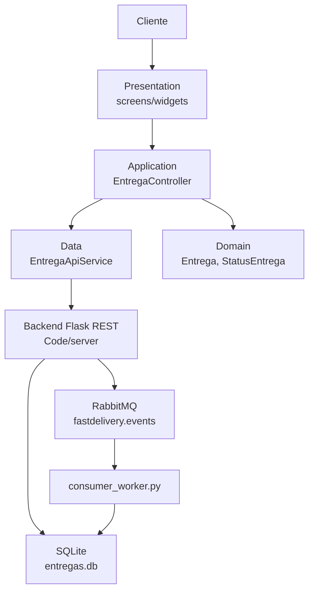

# Relatorio de Atendimento - Sprint 3

Auditoria realizada em 2026-06-15 sobre o repositorio `Lab-DAMD`.

## Fonte dos requisitos

O criterio usado nesta verificacao foi o PDF `docs/Projeto_LAMD_60445_2026_1.pdf`,
secao 3.4, "Sprint 3 - Aplicativo Flutter para o Cliente".

A Sprint 3 exige:

- App Flutter funcional para o perfil Cliente, com minimo de 3 telas.
- Integracao com o backend REST das sprints anteriores.
- Atualizacao assincrona de estado por MOM ou mecanismo equivalente, como polling.
- Arquitetura do app documentada em camadas.
- Codigo-fonte executavel ou APK.

## Resultado geral

Status: Sprint 3 atendida.

Nao foram encontrados erros de atendimento aos requisitos oficiais da Sprint 3
durante esta auditoria. Por isso, nenhum `erro.md` foi criado.

## Matriz de atendimento

| Requisito oficial da Sprint 3 | Situacao | Evidencia encontrada |
|---|---|---|
| App Flutter funcional para o cliente | Atendido | Projeto em `Code/mobile/fastdelivery_cliente/`, com Material 3 e escopo restrito ao perfil Cliente. |
| Minimo de 3 telas | Atendido | Telas `entrega_list_screen.dart`, `entrega_detail_screen.dart` e `entrega_form_screen.dart`. |
| Integracao com backend REST | Atendido | `EntregaApiService` consome `POST /entregas`, `GET /entregas`, `GET /entregas/<id>` e `PATCH /entregas/<id>/status`. |
| Atualizacao assincrona de estado | Atendido | Polling REST a cada 5 segundos em lista e detalhes, usando `Timer.periodic` e parando em `dispose`. |
| Arquitetura do app documentada | Atendido | `docs/Sprint3/arquitetura_app_cliente.md` descreve camadas, estrutura de pastas e fluxos. |
| Codigo-fonte executavel | Atendido | Projeto Flutter completo com `pubspec.yaml`, Android configurado, README de execucao e testes automatizados. |

## O que foi implementado na Sprint 3

### 1. App Flutter do Cliente

O app foi criado em `Code/mobile/fastdelivery_cliente/` e representa apenas o
usuario Cliente, como exigido para a Sprint 3. O app permite:

- Listar entregas do cliente de demonstracao.
- Criar nova entrega.
- Consultar detalhes de uma entrega.
- Cancelar entrega ainda pendente.
- Acompanhar mudancas de status sem acao manual.

O `cliente_id` fixo usado na Sprint 3 e `cliente-demo-001`, mantendo login e
autenticacao fora do escopo atual.

### 2. Telas entregues

| Tela | Arquivo | Funcao |
|---|---|---|
| Lista de entregas | `lib/features/entregas/presentation/screens/entrega_list_screen.dart` | Tela inicial, estado vazio, erro, carregamento, lista e acao de criar entrega. |
| Detalhes da entrega | `lib/features/entregas/presentation/screens/entrega_detail_screen.dart` | Mostra campos completos, status, progresso e botao de cancelar apenas quando pendente. |
| Nova entrega | `lib/features/entregas/presentation/screens/entrega_form_screen.dart` | Formulario com `descricao`, `origem`, `destino`, validacao e envio para o backend. |

### 3. Integracao REST

A integracao com o backend fica em:

`Code/mobile/fastdelivery_cliente/lib/features/entregas/data/entrega_api_service.dart`

Rotas consumidas:

| Funcao no app | Metodo e rota | Observacao |
|---|---|---|
| Criar entrega | `POST /entregas` | Envia `descricao`, `origem`, `destino` e `cliente_id`; o backend define `status = pendente`. |
| Listar entregas | `GET /entregas` | O app filtra localmente pelo `cliente_id` de demonstracao. |
| Buscar detalhes | `GET /entregas/<id>` | Usado na tela de detalhes e no polling. |
| Cancelar entrega | `PATCH /entregas/<id>/status` | Envia apenas `{"status":"cancelado"}`. |

O backend preserva os contratos anteriores em `Code/server/app/controllers/` e os
casos de uso seguem publicando eventos de dominio em criacao e mudanca de status.

### 4. Atualizacao assincrona por polling

A Sprint 3 permite MOM direto, WebSockets ou polling. A decisao implementada foi
polling REST a cada 5 segundos, documentada como mecanismo assincrono equivalente.

Evidencias no codigo:

- `ApiConfig.intervaloPolling = Duration(seconds: 5)`.
- `EntregaListController` usa polling de `GET /entregas`.
- `EntregaDetailController` usa polling de `GET /entregas/<id>`.
- Os controllers evitam requisicoes sobrepostas.
- Os timers sao cancelados em `dispose`.

Fluxo demonstravel:

1. Cliente cria entrega no app.
2. App mostra a entrega como `pendente`.
3. Um status e alterado fora do app por `PATCH /entregas/<id>/status`.
4. Em ate 5 segundos, a tela reflete o novo status sem botao de atualizar.

### 5. Arquitetura Flutter

A organizacao segue camadas simples, alinhadas ao que foi pedido na Sprint 3 e
inspiradas em Clean Architecture. A ideia principal e separar regras de negocio,
acesso a dados, controle de estado e interface, evitando que a tela conheca
detalhes de HTTP, JSON ou persistencia.

```text
lib/
  core/
    config/
    http/
  features/
    entregas/
      domain/
      data/
      application/
      presentation/
```

Responsabilidades:

- `domain`: modelo `Entrega` e enum `StatusEntrega`.
- `data`: servico REST `EntregaApiService`.
- `application`: controllers com estado, polling e orquestracao dos fluxos.
- `presentation`: telas e widgets reutilizaveis, sem regra de negocio pesada.
- `core`: configuracoes e excecoes compartilhadas.

A dependencia externa principal e `http`, sem Bloc, Riverpod, GetX ou geracao de
codigo. Isso mantem a entrega simples, executavel e aderente ao prazo da Sprint 3.

#### Leitura pela Clean Architecture

| Camada | Papel no app | Arquivos principais |
|---|---|---|
| Presentation | Mostra telas, recebe toques e renderiza estados visuais. | `presentation/screens/*`, `presentation/widgets/*` |
| Application | Guarda estado da tela, chama casos de uso simples e controla polling. | `application/entrega_controller.dart` |
| Domain | Representa conceitos do negocio sem depender de Flutter ou HTTP. | `domain/entrega.dart`, `domain/status_entrega.dart` |
| Data | Fala com servicos externos e converte JSON em objetos do dominio. | `data/entrega_api_service.dart` |
| Core | Configuracao e erros compartilhados. | `core/config/api_config.dart`, `core/http/api_exception.dart` |

O fluxo pratico fica assim:

```text
Tela Flutter -> Controller -> Service REST -> Backend Flask
      ^             |              |
      |             v              v
      +------ estado/notificacao   JSON/HTTP
```

#### Diagrama de camadas

O diagrama de camadas foi criado em `docs/Sprint3/arquitetura_app_cliente.md`.
Para deixar o relatorio autocontido, o mesmo desenho arquitetural da Sprint 3
tambem fica registrado abaixo:



Essa separacao permite trocar detalhes de infraestrutura com menos impacto. Por
exemplo, se no futuro o app usar autenticacao ou cache local, a mudanca deve
entrar em `data`/`core`, sem obrigar as telas a entenderem como token, storage ou
HTTP funcionam.

### 6. Conceitos Flutter da aula aplicados

A aula `aula07_flutter (2).html` apresentou conceitos de Flutter, Dart, widgets,
estado, REST, seguranca e storage. A Sprint 3 aplica principalmente os conceitos
de widgets, estado, ciclo de vida, null safety, Material Design, REST e testes.

#### StatefulWidget e ciclo de vida

As telas de lista, detalhes e formulario sao `StatefulWidget` porque precisam
guardar estado temporario da UI: carregamento, dados recebidos, formulario em
envio e polling ativo.

Exemplo da lista:

```dart
class EntregaListScreen extends StatefulWidget {
  const EntregaListScreen({super.key, required this.service});

  final EntregaApiService service;

  @override
  State<EntregaListScreen> createState() => _EntregaListScreenState();
}
```

O ciclo de vida aparece no `initState` e no `dispose`. No `initState`, a tela
carrega os dados e inicia o polling. No `dispose`, libera o controller e cancela
o timer, evitando requisicoes depois que a tela saiu da arvore de widgets.

```dart
@override
void initState() {
  super.initState();
  _controller.carregar();
  _controller.iniciarPolling();
}

@override
void dispose() {
  _controller.dispose();
  super.dispose();
}
```

#### Estado local com setState

O formulario usa estado local para controlar se a entrega esta sendo enviada.
Quando `_enviando` vira `true`, o botao e desabilitado e o texto muda para
`Enviando...`.

```dart
if (!_formKey.currentState!.validate()) {
  return;
}
setState(() => _enviando = true);
```

Esse e um uso adequado de `setState`: o estado pertence somente ao formulario.
Ja a lista e os detalhes usam `ChangeNotifier`, porque precisam combinar dados
vindos da API, polling, loading, erro e cancelamento.

#### Tratamento de loading, erro e dados

A lista trata os tres estados basicos recomendados na aula para telas que buscam
dados de API:

```dart
if (_controller.carregando && entregas.isEmpty) {
  return const LoadingView(mensagem: 'Carregando entregas...');
}
if (_controller.erro != null && entregas.isEmpty) {
  return ErrorView(
    mensagem: _controller.erro!,
    onRetry: () => _controller.carregar(),
  );
}
if (entregas.isEmpty) {
  return const EmptyState(...);
}

return RefreshIndicator(
  onRefresh: _controller.carregar,
  child: ListView.builder(...),
);
```

Assim o usuario nunca fica diante de uma tela sem contexto. O app informa quando
esta carregando, quando ocorreu erro, quando nao ha entregas e quando ha dados.

#### Null safety

O modelo `Entrega` usa tipos opcionais quando o backend pode nao enviar um campo,
por exemplo `criadoEm` e `atualizadoEm`.

```dart
final String? criadoEm;
final String? atualizadoEm;

StatusEntrega? get statusEnum => StatusEntrega.fromValor(status);
```

Nas telas, o codigo trata esses valores antes de exibir:

```dart
valor: entrega.criadoEm ?? '-',
valor: entrega.atualizadoEm ?? '-',
```

Isso segue o conceito de null safety da aula: o codigo precisa reconhecer quando
um valor pode ser nulo e decidir explicitamente o que fazer.

#### REST com async/await

O app usa o pacote `http`, como sugerido na aula para comecar, e encapsula as
chamadas REST em `EntregaApiService`.

```dart
Future<List<Entrega>> listar({String? status}) async {
  final resp = await _enviar(() => _client.get(uri));
  _garantirSucesso(resp);
  final dynamic corpo = _decodificar(resp.body);
  return corpo
      .whereType<Map<String, dynamic>>()
      .map(Entrega.fromJson)
      .toList(growable: false);
}
```

O ponto importante e que a rede nao bloqueia a UI. A chamada retorna um `Future`,
o controller aguarda com `await`, e a tela e redesenhada quando o estado muda.

#### Material Design e widgets

O app usa Material 3 no `MaterialApp`:

```dart
theme: ThemeData(
  colorScheme: ColorScheme.fromSeed(seedColor: const Color(0xFF2563EB)),
  useMaterial3: true,
),
```

Nas telas, os componentes seguem o padrao Material: `Scaffold`, `AppBar`,
`FloatingActionButton`, `FilledButton`, `TextFormField`, `SnackBar`, `Card`,
`ListView` e `RefreshIndicator`.

#### Conceitos da aula que ficaram fora do escopo

Storage local (`shared_preferences`, `sqflite`, `flutter_secure_storage`) nao foi
implementado na Sprint 3 porque o app nao salva dados no aparelho; a persistencia
fica no backend. Autenticacao tambem ficou fora do escopo: o app usa
`cliente-demo-001` ate uma sprint futura introduzir login e tokens.

### 7. Preservacao das Sprints 1 e 2

A Sprint 3 nao alterou o contrato REST para acomodar o mobile. O app consome a API
existente.

A mensageria da Sprint 2 tambem foi preservada:

- RabbitMQ continua como broker real.
- Flask continua produtor por padrao.
- `consumer_worker.py` continua sendo o consumidor independente.
- `InMemoryEventBus` permanece reservado para testes.
- Eventos `entrega.criada` e `entrega.status_atualizado` continuam sendo
  publicados pelo backend.

## Evidencias visuais

As imagens abaixo estao na raiz do repositorio e mostram a aplicacao rodando em
um telefone Android simulado no Android Studio.

### Tela inicial - lista vazia

Mostra a tela principal do app, com estado vazio, botao de atualizar e acao para
criar uma nova entrega.


### Tela de nova entrega

Mostra a tela de criacao com os tres campos exigidos pelo fluxo da Sprint 3.


### Formulario preenchido

Mostra o formulario preenchido antes do envio para o backend.


### Entrega criada pelo frontend

Mostra a entrega criada aparecendo na lista do app. A imagem tambem registra logs
do backend com `POST /entregas` retornando `201` e `GET /entregas` retornando
`200`, evidenciando a integracao REST real.


## Evidencias de testes

Tambem existem saidas salvas em `docs/Sprint3/evidencias/`:

| Arquivo | Evidencia |
|---|---|
| `backend_unittest.txt` | Testes do backend com `Ran 24 tests ... OK`. |
| `flutter_analyze.txt` | Analise Flutter sem problemas: `No issues found!`. |
| `flutter_test.txt` | Testes Flutter com `All tests passed!`. |

Nesta auditoria, os comandos tambem foram executados novamente:

```powershell
# Code/server/
py -m unittest discover -s tests -v
# Resultado: Ran 24 tests in 2.085s - OK

# Code/mobile/fastdelivery_cliente/
flutter analyze
# Resultado: No issues found!

flutter test
# Resultado: All tests passed! (15 testes)
```

## Relacao com a rubrica de 20 pontos

| Criterio oficial | Peso | Atendimento |
|---|---:|---|
| Funcionalidade do app | 6,0 | Atendido: cria, lista, detalha e cancela entregas. |
| Integracao REST correta | 5,0 | Atendido: app consome os endpoints REST existentes. |
| Atualizacao assincrona | 4,0 | Atendido: polling automatico de 5 segundos em lista e detalhes. |
| Organizacao Flutter | 3,0 | Atendido: codigo separado em domain, data, application e presentation. |
| Qualidade da interface | 2,0 | Atendido: telas claras, estados de vazio/erro/carregamento e botoes adequados ao fluxo. |

## Conclusao

A Sprint 3 esta atendida para o escopo oficial de "Aplicativo Flutter para o
Cliente". O app cliente existe, e executavel, possui as tres telas obrigatorias,
integra com o backend REST, reflete atualizacoes de status por polling assincrono,
mantem a arquitetura documentada e preserva a camada MOM das sprints anteriores.
